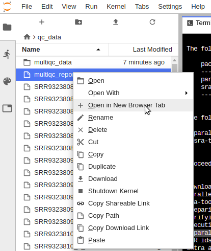

# Sequencing run QC

## Get some sequence data

The first thing we'll do is to get some sequence data to work with.
Published sequence data is usually archived in the NCBI SRA, the ENA, and the DDBJ.
These databases provide a [convenient interface to search](https://www.ncbi.nlm.nih.gov/) the descriptions of samples by keyword, and by sample type (e.g. shotgun metagenome).
For the following exercises we'll use accession SRR9323808 which is a small dataset and therefore quick to process.
The easiest way to download data from these databases is via the `fastq-dump` software.
First, let's install the parallel version of fastq-dump using conda.
To do this, start a terminal session in your Jupyter server (click the Terminal icon) and run the following command (ok to copy and paste):

```
conda install -c bioconda parallel-fastq-dump 
```

Now that you've installed fastq-dump we can use it to download data by accession number. Copy and paste the following to your terminal:

```
parallel-fastq-dump -s SRR9323808 -s SRR9323810 -s SRR9323811 -s SRR9323809 --threads 4 --outdir qc_data/ --split-files --gzip
```

If the download was successful you should see something like the following on your terminal:


## Evaluating sequence quality with FastQC and MultiQC


```
conda install -c bioconda fastqc
pip install multiqc
```

```
cd qc_data
find . -name "*.fastq.gz" -exec fastqc {} \;
```

Let's unpack those commands a bit. The first part, `cd qc_data` just changes the current directory to qc_data, so any following commands run will run in that directory.
The next command is `find . -name "*.fastq.gz" -exec fastqc {} \;`. The first part, `find` is a command that finds files. If you just run `find .` it will find all the files in and below the current directory (the `.` part specifies to look in the current directory). The next part, `-name "*.fastq.gz"` tells `find` that we only want it to find files with names that end with `.fastq.gz`. The `*` is a wildcard that matches anything. Finally, the last part `-exec fastqc {} \;` tells `find` that whenever it finds a file, it should run `fastqc` on that file, putting the name of the file where the `{}` are.

If this step has worked, then you should have several new `.zip` files containing the QC data in that directory, along with some html files. When we have a lot of samples it is too tedious to look at all the QC reports individually for each sample, so we can summarize them using multiqc:

```
multiqc .
```

At this point a multiqc file will appear inside the QC directory. First double click to open the QC folder.


Once that's open a file called `multiqc_report.html` will appear in the listing. 
We can open this file from within our jupyter browser environment and inspect it.
To open it, we need to right click (or two-finger tap) on the file name to get a context menu that will give several options for how to open it. It looks like this:



Click the option to "Open in a New Browser Tab"


## Taxonomic analysis

Metagenome taxonomic analysis offers a means to estimate a microbial community profile from metagenomic sequence data.

### Taxonomic analysis with Kraken2

```
conda install -c bioconda kraken2
```

### Taxonomic analysis with Metaphlan2

While it may be possible to install metaphlan2 via conda, at least in my experience, conda struggles with "solving the environment".
Another way to install it if you're using a debian-derived Linux (e.g. ubuntu) is via apt-get, thanks to the debian-med team who have packaged it:

```
sudo apt-get install metaphlan2
```

The install can be quite slow because it needs to create a bowtie index of the database of marker gene sequences that metaphlan2 uses. It also requires a fair bit of RAM, so ensure your machine has at least 8G RAM before trying to install this.


### Taxonomic analysis with other tools

There are a whole range of other software tools available for metagenome taxonomic analysis. 
They all have strengths and weaknesses.

A few other commonly used tools are listed here:

* [MEGAN](http://ab.inf.uni-tuebingen.de/software/megan6/)
* [Centrifuge](http://www.ccb.jhu.edu/software/centrifuge/manual.shtml)
* [CLARK](http://clark.cs.ucr.edu/)


### Evaluating the host genomic content

The above samples were sourced from a pig gut. Each one of the samples was taken from a different part of the pig gut, including the duodenum, jejunum, ileum, colon, and caecum.

If we were to design a large study around these samples which of them would be suitable for metagenomics, and why?


## A note on negative controls

Negative controls are a key element in any microbiome profiling or metagenome analysis work.
Every aspect of the sample collection and processing can be impacted by the presence of contaminating microbial DNA.
This is true even of 'sterile' material -- just because no viable cells exist in a sample collection swab, for example, does not mean there is no microbial DNA on that swab.
It is well known that molecular biology reagents frequently contain contaminating DNA.
Usually it is at low levels, but this is not always the case.

Therefore, the best practice is to collect multiple negative control samples that are taken all the way through sequencing.
These negative controls can then be used to correct for contamination artifacts in the remaining samples.

